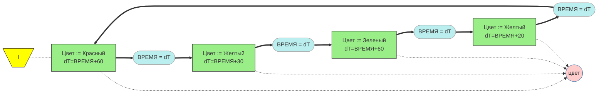

```mermaid 
flowchart LR 
%% задаем структуру трека 
h1[Цвет := Красный<br>dT=ВРЕМЯ+60] ==> h2([ВРЕМЯ = dT]) 
h3[Цвет := Желтый<br>dT=ВРЕМЯ+30] ==> h4([ВРЕМЯ = dT]) 
h5[Цвет := Зеленый<br>dT=ВРЕМЯ+60] ==> h6([ВРЕМЯ = dT]) 
h7[Цвет := Желтый<br>dT=ВРЕМЯ+20] ==> h8([ВРЕМЯ = dT]) 
h2 ==> h3 
h4 ==> h5 
h6 ==> h7 
h8 ==> h1 
%% задаем виды связей и параметры 
h1 -.->par1((цвет)) 
h3 -.->par1 
h5 -.->par1 
h7 -.->par1 
p0[\I/] -.- h1 
%% задаем раскраску 
classDef cond fill:#bee,stroke:#aaa,stroke-width:1px; 
classDef state fill:#9e8,stroke:#333,stroke-width:1px; 
classDef params fill:#fcc,stroke:#159,stroke-width:1px; 
class h1,h3,h5,h7 state; 
class h2,h4,h6,h8 cond; 
class par1 params; 
style p0  fill:#ff0,stroke:#100,stroke-width:1px; 
```
