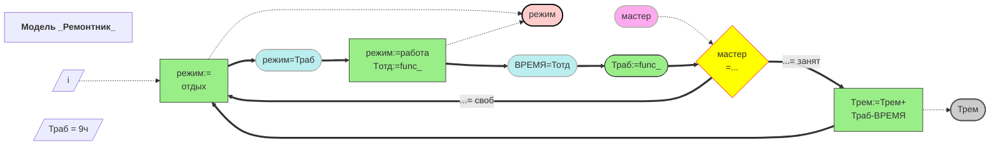

```mermaid 
flowchart LR 
title[<b>Модель _Ремонтник_</b>] 
r1[/"i"/] -.-> r2["режим:=<br>отдых"]; 
r_0[/"Траб = 9ч"/]
r2 -.-> r_1(["режим"])
r2 ==> r3(["режим=Траб"]); 
r3 ==> r4["режим:=работа<br>Tотд:=funс_"]; 
r4 -.-> r_1(["режим"])
r4 ==> r5(["ВРЕМЯ=Тотд"]); 
r5 ==> r6(["Траб:=func_"]); 
r_2(["мастер"])  -.-> r7
r6 ==> r7{"мастер<br>=..."}; 
r7 ==>|"...= занят"| r8["Tрем:=Трем+<br>Траб-ВРЕМЯ"]; 
r8 -.-> r9(["Трем"])
r7 ==>|"...= своб"| r2;
r8 ==> r2

classDef cond fill:#bee,stroke:#aaa,stroke-width:1px; 
classDef state fill:#9e8,stroke:#333,stroke-width:1px; 
class r2,r4,r6,r8 state; 
class r3,r5 cond; 
style r7 fill:yellow,stroke:red; 
style r_1 fill:#fcc,stroke:#111,stroke-width:2px; 
style r_2 fill:#fae,stroke:#bbb,stroke-width:2px; 
style r9 fill:#ccc,stroke:#555,stroke-width:2px;
```
