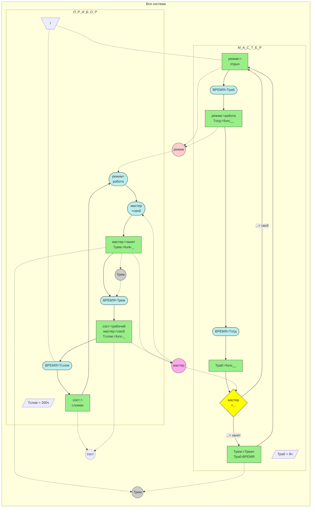

```mermaid
flowchart LR
    subgraph whole [Вся система]
        subgraph one [<i>П_Р_И_Б_О_Р</i>]
            p0[\I/] -.- h1
            h01[/Тслом = 200ч/]
            h1([BPEMЯ=Tслом])==> h2[сост:=<br>сломан]
            h2 ==> h3([режим=<br>работа])
            h3 ==> h4([мастер<br>=своб])
            h4 ==> h5[мастер:=занят<br>Tрем:=funk-_]
            h5 ==> h7([ВРЕМЯ=Трем])
            h7 ==> h8[сост:=рабочий<br>мастер:=своб<br>Tслом:=func-_]
            h8 ==> h1

            h5 -.->par41((Трем)):::partre
            par41 -.-> h7

            classDef cond fill:#bee,stroke:#333,stroke-width:1px;
            classDef state fill:#9e8,stroke:#333,stroke-width:1px;
            classDef navig fill:#fec,stroke:#333,stroke-width:1px;
            classDef parone fill:#fcc,stroke:#333,stroke-width:1px;
            classDef partwo fill:#fae,stroke:#333,stroke-width:1px;
            classDef partre fill:#ccc,stroke:#333,stroke-width:1px;
            class h5,h8,h2 state;
            class h1,h3,h4,h7 cond;

        end;

        subgraph master [М_А_С_Т_Е_Р]
            p0[\I/] -.- h11
            h11[режим:=<br>отдых]:::state==> h12([BPEMЯ=Tраб]):::cond
            h12 ==> h13[режим:=работа<br>Tотд:=func__]:::state
            h13 ==> h14([BPEMЯ=Tотд]):::cond
            h14 ==> h17[Tраб:=func__]:::state
            h17 ==> h15{мастер<br>=...}:::nav
            h15 ==>|"...= занят"| h16[Tрем:=Трем+<br>Траб-ВРЕМЯ]:::state
            h15 ==>|"...= своб"| h11
            h16 ==> h11

            h011[/Траб = 9ч/]

            classDef cond fill:#bee,stroke:#333,stroke-width:1px;
            classDef state fill:#9e8,stroke:#333,stroke-width:1px;
            classDef nav fill:#ff0,stroke:#333,stroke-width:1px;
            classDef parone fill:#fcc,stroke:#333,stroke-width:1px;
            classDef partwo fill:#fae,stroke:#333,stroke-width:1px;
            classDef partre fill:#ccc,stroke:#333,stroke-width:1px;

        end;

        par1((режим)):::parone -.->h3
        h2 -.->par3((сост))
        h8 -.->par3((сост))
        par2((мастер)):::partwo -.->h4
        h5 -.->par4((Трем))
        h5 -.->par2((мастер))
        h8 -.->par2((мастер))

        h11 -.-> par1((режим))
        h13 -.-> par1((режим))

        h16 -.->par4((Трем)):::partre
        par2((мастер)):::partwo -.->h15

        linkStyle default stroke:#333,stroke-width:1px;
    end
    click par2 href "https://www.mos.ru" "переход для Мастера" _blank;
    click par1 href "https://bmstu.ru/" "переход для Режима" _blank;
    click par3 href "https://github.com/iu5git/Web" "переход для Сост" _blank;
```
